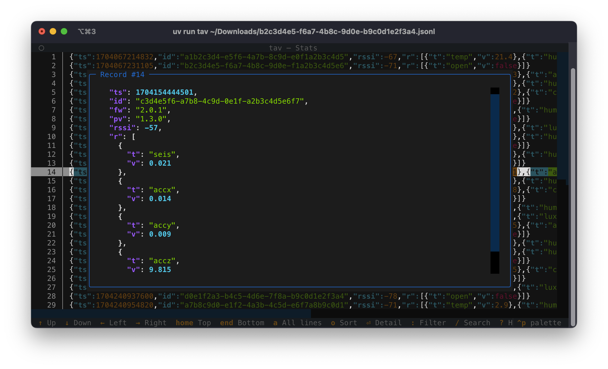
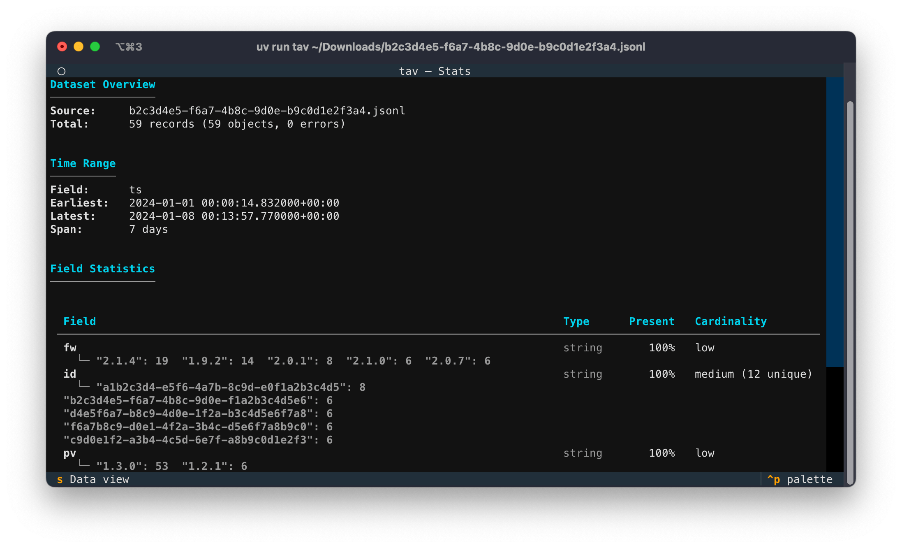

# tav

The time-series data viewer, **tav**, is a simple, convenient terminal tool for viewing time-series data stored in JSON Lines (JSONL) format. It provides an easy-to-use interface for analyzing, filtering and querying the data, as well as some basic stats and aggregated metrics.

<div style="display: flex; gap: 10px;">
  
  
</div>

## Run Locally

```shell
git clone https://github.com/jsynowiec/tav && cd tav
uv run tav
```

## Usage

```shell
tav [INPUT] [OPTIONS]

Arguments:
  INPUT    Path to input JSONL file. Omit or use '-' for stdin.

Options:
  -h, --help            show this help message and exit
  --time-field FIELD
                        Dot-path to the timestamp field (e.g. timestamp or $.timestamp)
  --stats               Start in the stats view
  --version             show program's version number and exit
```
